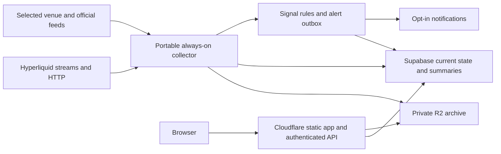

# daVIRA: product and deployment plan

Research date: 16 September 2026. Prices are USD before taxes. This is a planning document; no deployment or trading has been performed.

Hosting revision: Render is one option, not a requirement. After comparing additional providers, the preferred free-beta candidate is Northflank Sandbox, with Railway as a credit-limited alternative and Oracle Always Free as a self-managed VM option. Actual account availability, quotas and collector performance still need validation.

## 1. Recommended direction

Build an affordable Hyperliquid research terminal that helps users answer four questions:

1. Which traders have repeatable, risk-adjusted performance?
2. Which credible traders are changing exposure before an unusual market move?
3. Do other wallets, venues and upcoming events support that interpretation?
4. Would following the trade still make sense after delay, fees, funding and slippage?

Keep the $5/month plan useful: discovery, wallet profiles, coin intelligence, events, alerts, reports and paper-copy analysis. Introduce execution separately after validating the data and operating model. Broad coverage can expand gradually without changing this core workflow.

One day can produce a working vertical slice. It cannot establish repeatable predictive performance, reconstruct complete market history, or demonstrate reliable handling of customer trades.

### What competitors already provide

The public [Hyperclone Discover page](https://hyperclone.bot/discover/) was inspected in a browser. It has wallet search, categories, PnL windows, drawdown, win rate, equity, position counts, favourites, notifications and clone deployment links. Its homepage also describes copy controls. These are baseline features, not sufficient differentiation.

[Nansen's documented Smart Money API](https://docs.nansen.ai/api/smart-money) includes wallet cohorts, flows, holdings, DEX trades and Hyperliquid perp trades. [Hyperdash](https://hyperdash.com/) publicly displays trading, cohorts, position changes, TWAPs, news and copytrading. This was a public product review, not a benchmark of their algorithms or execution quality.

The proposed competitive advantage is transparent evidence, discovery of repeatable early positioning, realistic copyability, and useful alerts at an accessible price. It must be demonstrated with recorded results.

## 2. Findings in the existing project

- `lib/hyperliquid.ts` constructs sample wallet records, prices, flows and performance statistics. These are not measured market results.
- `scripts/hyperdash_scraper.py` assigns a front-running score from leaderboard rank. It does not establish that a wallet entered before a move, and the inspected script does not integrate a Hyperdash data feed or persist an ingestion pipeline.
- The wallet drawer's copy button opens a subscription modal; this is not a copy execution engine.
- The inspected SQL defines basic profiles, subscriptions and tracked wallets. A raw-event store, position reconstruction, metric provenance, alert delivery and access policies still need implementation.

Treat the existing UI as a prototype. Before a public release, replace placeholder results with measured values or clearly labelled unavailable states. Retire unsupported claims about insiders, institutional identities, exact liquidation outcomes, zero slippage and complete market coverage.

## 3. Feature roadmap

V1 means the first paid analytics release. V2 means an enhancement after live data collection and validation. V3 means additional infrastructure, provider access or execution engineering.

| Module | Useful depth | Release and dependency |
|---|---|---|
| Wallet discovery | Rank separately by net PnL, consistency, return on capital, drawdown, and evidence depth; filter by coin, holding period, capital and strategy | V1, initially a bounded curated universe |
| Wallet profiles | Equity curve, open/closed positions, fees, funding, deposits, withdrawals, leverage, exposure, trade replay and last verified time | V1; metrics depend on available history |
| Early-positioning radar | Repeated entries before unusual moves; entry timing, position additions, adverse movement and false alarms | V2 after historical and forward validation |
| Independent-wallet agreement | Count credible traders adding the same exposure; reduce the influence of suspected related wallets and one dominant whale | Simple V1 cohorts; relationship analysis V2 |
| Coin intelligence | Cohort exposure changes, spot flows, funding, open interest, liquidity and event timeline | V1 for selected supported instruments |
| Trader specialisation | Separate BTC, ETH, small-cap, long, short, trend, range and event performance | V2 when sample sizes permit |
| Copyability | Simulated follower returns after delay, order size, fees, funding, spread and market impact | Paper version V1; stronger depth-based replay V2 |
| RWA and global-market perps | Separate RWA-related tokens, actual tokenized assets, and derivatives referencing equities/commodities; add oracle and market-hours context | Small verified instrument list V1; expanded V2 |
| CEX/DEX confirmation | Compare equivalent products across venues: basis, funding, trade pressure, liquidity and rolling lead/lag | One additional venue V1/V2 |
| Liquidation exposure | Show current source-reported liquidation estimates for tracked accounts, distance and concentration; mark coverage | V2, account-state dependent |
| Event centre | CPI, FOMC, employment, PCE, GDP, unlocks and protocol announcements; local time, source and tracked exposure | Official macro calendar V1; licensed consensus later |
| Asset reports | Fixed structure: market changes, credible-wallet actions, liquidity, fundamentals, catalysts, scenarios and missing information | V1 for a limited asset set |
| News and socials | Deduplicated source links, event classification, asset relevance, rumours versus confirmed announcements | Curated primary sources V1; broad social ingestion V3 |
| Portfolio view | Watchlists, concentration, overlapping wallet exposures, event exposure and alert preferences | V1/V2 |
| Live copy execution | Explicit permissions, execution journal, risk limits, reconciliation, revocation and emergency stop | V3 after paper trading and testnet validation |
| Additional DEX chains | Wallet attribution for swaps, transfers, bridges and liquidity changes | V3; add one chain and a few protocols at a time |

### 3.1 Wallet performance: make the ranking credible

Calculate realised PnL, unrealised PnL, trading fees and funding separately. Exclude deposits from profit; adjust equity returns for capital entering and leaving the measured account. Define whether the account boundary includes spot, perps, subaccounts and builder DEX balances, and handle internal transfers consistently.

Use completed position episodes for win rate rather than treating every partial fill as an independent winning trade. Split a direction reversal into a close and a new position. Count entry fees as well as exit fees. The API documents that `fee` already includes `builderFee`; do not subtract that component twice. [Hyperliquid fill schema](https://hyperliquid.gitbook.io/hyperliquid-docs/for-developers/api/info-endpoint)

Useful columns:

- Net performance over 7/30/90 days where supported by history.
- Return on capital and cash-flow-adjusted equity drawdown.
- Profit factor, average win/loss and concentration of profit in the best trade.
- Holding period, turnover, leverage and liquidity dependence.
- Long versus short results and coin-specific results.
- Funding contribution, fee drag and passive versus aggressive execution.
- Days observed, closed-position count, missing intervals and confidence.

Keep separate rankings instead of hiding everything in an arbitrary 0–100 score. A small sample should display “insufficient evidence.” An illustrative initial eligibility rule is 30 days observed and 30 completed position episodes; this is a product guardrail, not statistical proof, and position traders require different treatment. Meaningful 90-day metrics need 90 days of usable observations or validated historical data.

Later, compare performance with an appropriate market/sector benchmark and strategy peer group. A trader can profit simply from sustained market exposure. Hidden hedges on another account or CEX remain unknown.

### 3.2 Early-positioning radar: the strongest research feature

Use the name “early positioning.” Being early is evidence about timing; it does not establish insider knowledge or transaction front-running.

Proposed research pipeline:

1. Define a large move before testing. An example is a return over a fixed horizon exceeding a multiple of volatility measured before the entry, plus a minimum liquidity requirement.
2. Reconstruct entry/addition/exit episodes and exposure size relative to the wallet's equity.
3. Measure signed returns after entry over 15 minutes, 1 hour, 4 hours and 24 hours. Include the largest adverse excursion and executable prices after notification delay.
4. Count unsuccessful entries and occasions when no large move followed.
5. Compare with randomly timed entries in the same instrument/regime and with simple trend-following baselines.
6. Freeze wallet eligibility using only information available at the historical decision time. Include inactive and losing wallets in the research universe.
7. Separate training, tuning and evaluation dates. Account for overlapping trades, correlated wallets and testing many rules.
8. Publish every issued alert and its subsequent outcome, including failures, under a versioned rule.

Candidate live signals include an unusually large addition, a new instrument for that wallet, coordinated exposure among several credible traders, reduced available liquidity, and an approaching catalyst. These are hypotheses until validated.

Show an evidence card: what changed, when it changed, why the wallet qualified, its prior comparable sample, contradictory evidence, observation coverage and data freshness. Do not show a numerical probability until its accuracy is calibrated on held-out and forward data. A higher score must not be presented as an established probability by default.

### 3.3 Coin flows: distinguish three different measurements

| Measurement | What it means | Required evidence |
|---|---|---|
| Token/collateral transfers | Assets entering or leaving a defined set of addresses or venue | Transfer ledger and reliable address labels |
| Spot cohort net purchases | Selected wallets buying minus selling a token | Attributed spot fills or decoded swaps |
| Perp cohort positioning | Selected wallets increasing or reducing directional exposure | Fills plus a reconciled starting position |

A $1M perp long does not mean $1M entered the token. A buy can close a short. A rising USD position value can reflect price appreciation with no new trade. Measure quantity changes at a consistent reference price and show valuation changes separately.

Across the complete matched derivatives market, longs and shorts have counterparties. A selected cohort's bias is useful, but it is not aggregate money creation or proof that the entire market is net long.

Use an instrument key containing venue, chain where relevant, market type, builder DEX, base, quote and contract identity. Never merge tokens solely because their tickers match.

### 3.4 RWA and cross-market depth

Maintain three categories: ecosystem/governance tokens associated with RWA projects; actual tokenized assets with their issuer/underlying/redemption terms; and derivative contracts referencing conventional assets. A perp position gives derivative exposure, not ownership of the underlying asset.

HIP-3 market deployers define contract specifications and oracles. Track the specific builder DEX, collateral, oracle source, funding, market status and timestamp. Add scheduled earnings and conventional trading hours where relevant. Stale underlying prices during closures must be visible. [HIP-3 documentation](https://hyperliquid.gitbook.io/hyperliquid-docs/hyperliquid-improvement-proposals-hips/hip-3-builder-deployed-perpetuals)

For actual RWA token flows, later add the relevant chain's transfers, supply changes, mint/redemption activity and liquidity. Hyperliquid data alone cannot supply all of this.

Your CEX/DEX idea is useful as a research question. Do not assume a DEX consistently leads a CEX. Compare aligned timestamps, equivalent contracts, funding periods, stablecoin quotes, executable spreads and liquidity. Test both directions of influence and out-of-sample persistence. Initially use another venue to confirm or challenge a signal, with slow-enough horizons to match measured data latency.

Public CEX market streams provide market information, not named traders' private position histories. [Bybit public/private stream documentation](https://bybit-exchange.github.io/docs/v5/ws/connect), [Binance API catalogue](https://developers.binance.com/en/docs/catalog).

### 3.5 Events, reports and socially useful information

The calendar should distinguish release time, published value, previous value, revisions, and consensus forecast. Official dates and releases can anchor V1: [BLS CPI schedule](https://www.bls.gov/schedule/news_release/cpi.htm) and [Federal Reserve calendar](https://www.federalreserve.gov/monetarypolicy/fomccalendars.htm). Preserve the original time zone and convert for the user, including daylight-saving changes.

Historical event analysis should use the first published value and the forecast known before release. Revised data would give a backtest information traders did not have. Official calendars do not replace a commercial consensus feed; obtain a display licence if adding one. [Trading Economics calendar fields and methodology](https://docs.tradingeconomics.com/economic_calendar/snapshot/).

Connect events to portfolios: which followed wallets have increased exposure, what instruments are affected, and how volatility behaved around comparable past releases. Keep historical samples and limitations visible.

Reports should be shared per coin and reporting period. Calculate facts with code; an optional language model can explain a supplied evidence packet. Every numerical statement needs a source/time reference. Use “unavailable” for unsupported small-coin fundamentals. Avoid generating a new lengthy report for every page view.

Start news with permitted feeds and official project/exchange/regulator announcements. Store source, publication time, discovery time, entity tags and a short original summary. Merge duplicates. Keep rumours visibly unconfirmed. Broad X monitoring is metered and needs a separate budget; its current API uses pay-per-usage billing. [X billing](https://docs.x.com/x-api/fundamentals/post-cap).

### 3.6 Copyability before execution

A profitable source wallet may be unsuitable for copying because its advantage depends on rapid execution, rebates, off-venue hedges or liquidity that disappears before followers arrive.

Offer paper-copy profiles at several account sizes, delayed entry assumptions and slippage assumptions. Show realistic net returns, failed fills, maximum drawdown, capacity and overlap with other selected wallets. Bar-based simulations must disclose that they cannot reproduce the historical order queue or exact fills.

Live execution later needs an independent always-on service, persistent order intents, unique identifiers/nonces, restart-safe reconciliation, partial-fill handling, position ownership accounting and kill switches. Limits should cover position size, leverage, daily loss, price deviation and exposure across leaders. Define whether pause stops new entries or also closes positions, and whether existing source positions are copied at activation.

Use user-approved agent/API-wallet permissions with revocation; never collect seed phrases. Agent keys remain security-sensitive and can create losses. Non-custodial operation does not remove that risk. [Hyperliquid API wallets and nonces](https://hyperliquid.gitbook.io/hyperliquid-docs/for-developers/api/nonces-and-api-wallets).

Execution launch also depends on the operating entity, customer jurisdictions and venue/payment-provider eligibility. Those are unresolved because the intended launch markets have not been specified.

## 4. Data acquisition and coverage

### Primary source strategy

| Source | Proposed role | Cost/dependency boundary |
|---|---|---|
| Hyperliquid documented HTTP/WebSocket API | Live supported markets, wallet account state and recent fills | Public access with limits; validate permitted product use |
| Hyperliquid historical archives | Targeted backfills and later broader reconstruction | Requester pays transfer costs; verify date coverage and gaps |
| Hyperdash | External profile links and optional enrichment | No documented commercial feed/licence was verified in this review |
| Nansen | Optional licensed labels/enrichment | Do not include in zero-cost base assumptions |
| Binance/Bybit or another accessible venue | Cross-market prices, funding and order-book context | Check region, terms and exact endpoint limits |
| DEX Screener | Supplemental pool/token market context | Does not replace a wallet transaction indexer; [API reference](https://docs.dexscreener.com/api/reference) |
| CoinGecko/other token providers | Optional metadata and broad-market enrichment | Confirm the applicable commercial display/redistribution licence; [licensing](https://www.coingecko.com/en/api/enterprise/data-license) |
| Official agencies and project feeds | Calendars and announcements | Scheduled refresh; track corrections and permitted reuse |

Do not make the business depend on scraping Hyperdash's UI or reverse-engineering its private endpoints. If an official commercial agreement becomes available, isolate it behind a provider adapter. Public visibility does not establish permission to resell a proprietary dataset.

### Discovery versus complete wallet history

Hyperliquid's market `trades` stream includes buyer and seller addresses. Use it to discover active wallets within covered instruments. User-specific streams have separate limits, so do not allocate a permanent account stream to every customer watchlist. [WebSocket schema](https://hyperliquid.gitbook.io/hyperliquid-docs/for-developers/api/websocket/subscriptions).

The documented per-IP budget is 1,200 REST weight/minute; `clearinghouseState` weighs 2. User-specific WebSocket subscriptions are limited to 10 unique users. These constrain the design even when there is no per-call invoice. [API limits](https://hyperliquid.gitbook.io/hyperliquid-docs/for-developers/api/rate-limits-and-user-limits).

Illustrative scheduling: 300 wallets refreshed every 5 minutes consume 120 weight/minute for one account-state request each. Refreshing 1,000 every minute would consume 2,000 before any fills or metadata. Builder DEX requests and returned-history weights add to the total. Reserve substantial headroom and prioritise recent activity, open profiles and reconciliation.

Recent fill retrieval is bounded: `userFillsByTime` returns at most 2,000 fills per response and exposes only the most recent 10,000. This cannot guarantee an active trader's full lifetime record. [Info endpoint](https://hyperliquid.gitbook.io/hyperliquid-docs/for-developers/api/info-endpoint).

Use a growing registry of observed wallets, a smaller deeply tracked pool, and queued historical enrichment. Initially target 10–20 instruments and 100–300 deeply tracked wallets, subject to throughput measurement. An arbitrary searched address can receive a current snapshot and a visible pending/limited-history state. A user watchlist slot does not automatically create unlimited new ingestion capacity.

“All Hyperliquid wallets” is a later coverage objective: discovery across all instrument namespaces, account/ledger reconstruction, historical fills, reconciliation and documented gaps. The [official archives](https://hyperliquid.gitbook.io/hyperliquid-docs/historical-data) include node trade/fill data and require the requester to pay transfer costs. Historical asset archives may also be late or incomplete. A node/indexer/provider evaluation belongs after measuring actual requirements.

## 5. Deployment choices

### Can Supabase + Render + Vercel all stay free?

For a limited non-commercial prototype, largely yes. For a subscription product, Vercel Hobby is not the appropriate plan. A bounded beta can instead combine Cloudflare, Supabase Free and a free always-on collector host; retain a paid fallback for growth and operating requirements.

| Service | Verified limitation | Consequence |
|---|---|---|
| Supabase Free | 500 MB database; 5 GB uncached egress, plus a separate 5 GB cached allowance; pauses after one week inactive | Useful for bounded beta data; unsuitable as an unlimited tick archive |
| Render Free | Sleeps after 15 minutes without inbound activity; free background workers are unavailable; ephemeral local files | A production collector should use paid always-on compute |
| Vercel Hobby | Restricted to non-commercial personal use | Use Pro for a subscription business, or choose a different frontend host |
| Cloudflare Workers static assets | Static requests are free; dynamic requests/CPU are separately limited | Low-cost frontend shell and light API boundary |

Sources: [Supabase pricing](https://supabase.com/pricing), [Render free limits](https://render.com/docs/free), [Vercel Hobby rules](https://vercel.com/docs/plans/hobby), [Workers static asset billing](https://developers.cloudflare.com/workers/static-assets/billing-and-limitations/).

### Alternatives to Render: free-beta comparison

| Provider | Current offer | Fit for the collector |
|---|---|---|
| Northflank Sandbox | Two free services, one database and two cron jobs; advertised as always-on without sleeping | Preferred managed-host candidate for the bounded beta; confirm assigned compute, network allowances and account requirements before deployment |
| Railway | $5 initial trial credit for up to 30 days, followed by $1/month non-rollover credit on Free | Useful for prototyping; a continuous process can exceed the recurring allowance |
| Oracle Cloud Always Free | Eligible VMs in the home region; current free-tenancy A1 allocation is described as 1,500 OCPU-hours and 9,000 GB-hours monthly, equivalent to 2 OCPUs/12 GB | More compute headroom if available; requires server administration and recovery planning |
| Google Cloud Compute Engine | Eligible e2-micro hours, 30 GB-month standard persistent disk and limited outbound transfer | Can run continuously; region and networking charges make a zero-dollar total conditional |
| Koyeb Free | One small web instance; mandatory idle scale-to-zero and no Worker Services | Suitable for a web demo; poor fit for continuous background collection |
| Fly.io | Limited trial rather than an ongoing free tier | Evaluate as a paid option, not the free-beta foundation |

Sources: [Northflank pricing](https://northflank.com/pricing), [Railway trial](https://docs.railway.com/pricing/free-trial), [Railway plans](https://docs.railway.com/pricing/plans), [Oracle Always Free](https://docs.oracle.com/en-us/iaas/Content/FreeTier/freetier_topic-Always_Free_Resources.htm), [Google free tier](https://docs.cloud.google.com/free/docs/free-cloud-features), [Koyeb instances](https://www.koyeb.com/docs/reference/instances), [Fly.io cost management](https://fly.io/docs/about/cost-management/).

**Railway budgeting.** For ordinary containers, published RAM pricing is $10/GB-month. A process averaging 0.25 GB continuously would use about $2.50/month in memory alone, before CPU, network or storage. That exceeds the $1 recurring credit. Hobby has a $5 monthly minimum that includes $5 usage; it is not $5 plus the entire resource bill. Higher usage increases the bill. Benchmark the collector before assuming it fits either allowance. Limited Trial accounts may also have outbound-network restrictions. [Resource rates](https://docs.railway.com/pricing/plans), [trial verification](https://docs.railway.com/pricing/free-trial).

**Oracle limitations.** Free capacity can be unavailable in the selected home region, and idle resources can be reclaimed. Some published larger A1 allowances apply to paid tenancies, so do not assume the older widely repeated 4-OCPU/24-GB figure applies to a new free account. Keep checkpoints and archives outside the VM, use automatic process restart and maintain a tested restore procedure. [Oracle free-resource conditions](https://docs.oracle.com/en-us/iaas/Content/FreeTier/freetier_topic-Always_Free_Resources.htm).

**Google networking.** Eligible compute does not make every attached resource free. Its VPC price list currently charges $0.005/hour for an in-use external IPv4 address on a standard VM, with a small free allowance; a continuously assigned address can therefore add roughly $3.60/month before other network charges. Include connectivity to Hyperliquid, Supabase and the archive in the estimate. [Google network pricing](https://cloud.google.com/vpc/network-pricing).

**Free-beta decision.** First test one Dockerized collector on Northflank Sandbox. Keep the existing bounded wallet/instrument scope, verify upstream connectivity, and measure ingestion lag, memory and egress for 24–48 hours. Confirm the account's Sandbox terms and quotas before making a paid launch commitment. If unsuitable, use Railway trial for a short evaluation or an available Oracle VM. The same container, external checkpoints and environment-based configuration should make moving hosts routine.

Cloudflare cron tasks can handle occasional calendars or reports, but they are not a drop-in host for the current long-running collector design. Scheduled snapshots would be a different, less continuous product mode. Do not use artificial keep-alive traffic as the foundation of reliable collection.

### Recommended minimum-cost design

- Keep React and the useful current screens. Export a static Next.js shell if its routes fit this model; serve protected data through an authenticated API. The current configuration is not yet a static export.
- Use Cloudflare Workers Static Assets for the shell and a small Worker for authentication checks, entitlement checks, read APIs and signed billing webhooks. Never expose paid snapshots in a public asset bucket.
- Package the collector and bounded analytics jobs as a portable container. Evaluate Northflank Sandbox first for the free beta; Railway, Oracle or paid Render can host the same process. A small instance is an entry benchmark, not proven capacity. Upgrade or split services when measured load requires it.
- Keep Supabase for authentication, user data, entitlements, current market state, summaries, rule definitions and durable alert jobs.
- Archive batched raw events privately in R2. Use time/market partitions and compressed files. Avoid one object upload per fill.
- Use scheduled jobs within the collector for reconciliation and routine reports; do not buy separate services before needed.
- Publish shared dataset versions and short-lived cache entries. Authenticate before serving paid cached responses; keep personalised data separate.

If preserving full Next.js server behaviour is the priority, Vercel Pro is the simpler alternative. A full server-rendered Next.js app needs a compatible runtime/adapter on Cloudflare; uploading it as static files is not equivalent.

### Base monthly service costs

| Configuration | Components | Base total |
|---|---|---:|
| Local/private proof | Local collector, free preview frontend and bounded Supabase Free | $0 hosting, local operating costs remain |
| Free-beta target | Cloudflare Free, Northflank Sandbox, Supabase Free and R2 within their verified allowances | $0 conditional on quotas and eligibility |
| Render beta alternative | Cloudflare $0–5, Render $7, Supabase Free, R2 within allowance | $7–12 |
| Paid Render reference configuration | Cloudflare $5, Render $7–25, Supabase Pro $25, R2 within allowance | $37–55 |
| Preserve Vercel workflow | Vercel Pro $20, Render $7–25, Supabase Pro $25, R2 within allowance | $52–70 |

These totals exclude domain registration, taxes, transactional email, payment charges, excess usage, additional projects/seats, paid data, historical downloads and labour. They assume a bounded shared dataset and no live copy engine. Recheck plans at purchase.

Sources: [Render compute pricing](https://render.com/pricing), [Cloudflare Workers pricing](https://developers.cloudflare.com/workers/platform/pricing/), [Vercel pricing](https://vercel.com/pricing), [Supabase pricing](https://supabase.com/pricing). R2 Standard includes 10 GB-month storage and operation allowances; beyond that storage is $0.015/GB-month with operation charges and no direct R2 egress fee. [R2 pricing](https://developers.cloudflare.com/r2/pricing/).

### Storage and bandwidth controls

Illustration, not measured load: 500 wallet snapshots every 5 minutes generate 4.32 million rows in 30 days. At an assumed 250 bytes per row, that is 1.08 GB before indexes and database overhead. A 500 MB database fills quickly even with modest wallet coverage.

Store current state by upsert. Retain selected detailed changes briefly in Postgres, archive raw evidence in R2, and keep compact hourly/daily aggregates in Postgres. Suggested starting policies are 24–72 hours of hot detail, 90 days of hourly summaries, and 12 months of daily summaries, all subject to measured byte budgets. Purge hot data only after archive validation; preserve evidence needed to reproduce issued signals.

Download example: 100 active viewers requesting a 20 KB response every 30 seconds for 4 hours/day over 30 days consume about 28.8 GB. This exceeds Supabase Free's uncached allowance. Shared authenticated caching, smaller deltas, page visibility checks and slower background refresh are necessary.

Suggested upgrade triggers: 70% of a quota, persistent memory above 70%, growing ingestion lag, archive retries, or a sustained rate-limit queue. Reduce low-priority enrichment during bursts and show stale data explicitly. Do not silently replace missing observations.

## 6. Deployment sequence and verification

1. **Lock the first scope.** Select instruments from live metadata, cap the global deep-tracking pool, define each metric and publish coverage labels. Obtain required provider permissions before enabling a feed.
2. **Prepare the application.** Replace prototype claims and sample results, update to maintained compatible dependencies, choose static shell versus Vercel SSR, and make local production builds reproducible.
3. **Create migrations and access rules.** Separate market data from users, watchlists and subscriptions. Enable row-level access controls and test users cannot read another user's private records. Server-only credentials must remain outside the browser bundle.
4. **Provision storage.** Choose nearby available collector/database regions, test upstream access from that region, create a private archive bucket, and set retention and cost alerts.
5. **Deploy the collector.** Add reconnect/backoff, event deduplication, checkpoints, versioned parsers, bounded queues and graceful shutdown. Use exact decimal types for monetary computation. Record source time and receipt time.
6. **Reconcile.** Bootstrap positions from authoritative account state, apply supported fill changes and periodically recheck. Label unknown starting state and missed intervals. A WebSocket connection alone does not prove complete data.
7. **Build summaries and signals.** Record the rule version, evidence references, cohort eligibility time and excluded data. Use a durable outbox to avoid duplicate or lost alerts; deliver only to opted-in recipients.
8. **Deploy frontend/API.** Add TLS/domain, login callbacks, CORS, rate limits, entitlement enforcement and visible freshness. A free user should not be able to retrieve paid data simply by bypassing UI controls.
9. **Add billing.** Verify payment-provider availability for the business and product. Test successful payment, failed payment, cancellation, renewal and repeated webhooks in sandbox. Grant access from verified server events. If supporting crypto payments later, handle unique invoice matching and confirmations; do not promise fee-free or private settlement.
10. **Verify operational recovery.** Test process restarts, upstream disconnects, duplicate events, malformed data and archive failures. Reconcile sampled wallet/position figures against upstream records. Test a backup restore and entitlement isolation.
11. **Run a private pilot.** Start with 10–30 testers. Measure p50/p95 freshness, duplicate/missed alerts, query latency, resource usage and retention. Publish a status page with the actual data coverage.
12. **Enable paid analytics.** Proceed when the defined data and billing checks pass. Keep unvalidated signals labelled experimental. Live execution has its own later acceptance gates.

Initial engineering targets, to be measured rather than advertised as guarantees: supported market/cohort updates within 30–60 seconds under normal load; deeply tracked account refresh around 5 minutes; slower queued history; clear stale status after a missed freshness target. Ingestion and notification delivery are different latency measurements.

Useful tables: instruments, wallets, wallet_observation_coverage, positions_current, position_episodes, wallet_equity_daily, wallet_metrics, coin_metrics, events, signal_versions, signals, signal_evidence, alert_rules, alert_outbox, watchlists, subscriptions, ingestion_checkpoints and archive_manifests. Raw-event volume belongs mainly in the archive; current-state tables should not accumulate full copies indefinitely.

## 7. $5 plan and economics

Recommended initial entitlement:

- Access to the full published curated discovery universe.
- Ten followed wallets from the supported pool; other addresses can be queued for evaluation.
- Ten active alert rules, cooldowns and a published delivery cap, initially 100/day.
- Profiles and coin dashboards for the initial supported market list.
- Available 30/90-day metrics with clear coverage, and research reports shared across subscribers.
- Calendar, one daily digest, and limited paper-copy analysis using shared presets.
- No unlimited raw export/API, broad social firehose or arbitrary expensive backtests.

Keep live execution separate from the $5 analytics promise until its true costs are measured. Possible later pricing is an explicit execution add-on or disclosed per-trade fee, subject to venue support and business review. Do not rely on hypothetical execution revenue to fund V1.

For a conservative illustration, reserve $0.50 from each $5 subscription for payment/refund friction. This is a planning assumption, not a processor quote or a tax calculation.

| Subscribers | Gross monthly revenue | After illustrative reserve | Contribution after $55 base infrastructure |
|---:|---:|---:|---:|
| 10 | $50 | $45 | -$10 |
| 25 | $125 | $112.50 | $57.50 |
| 100 | $500 | $450 | $395 |
| 500 | $2,500 | $2,250 | $2,195 |

The final column excludes support, marketing, labour, taxes and data fees; higher usage may also require larger infrastructure. At $55 fixed infrastructure, roughly 13 subscribers cover that bill under this assumption. That is infrastructure break-even, not company profitability.

Batch shared calculations and reports. If a data licence costs hundreds monthly, explicitly include it in the model before adding that feature. On a $5 product, data acquisition and customer support can cost more than hosting.

## 8. Implementation order

| Stage | Deliverable | Completion condition |
|---|---|---|
| Day-one slice | Real data for a few instruments/wallets, profile, source time, one alert rule and deployed preview | End-to-end data is real and reproducible |
| Approximately weeks 1–2 | Persistent collector, storage, reconciliation, discovery, cohort views and event calendar | Survives restart/disconnect; values reconcile |
| Approximately weeks 2–4 | Private pilot, paper-copy presets, billing sandbox, reports and operations | Freshness and cost targets hold under measured usage |
| After sufficient evidence | Early-positioning research and forward alert history | Evaluation uses information available at the time; performance beats chosen baselines if claiming an edge |
| Subsequent releases | Additional chains, richer RWA data, paid enrichment and live execution | Each source and feature passes independent cost, correctness and operating gates |

These are estimates for a focused implementation, not guaranteed dates. Engineering time, historical data availability and observation time are separate constraints. Do not fill a short history with invented 90-day statistics.

## Final recommendation

Start with Hyperliquid, a bounded wallet pool, useful coin-level context and paper-copy evaluation. Design the data engine to expand. For the free beta, evaluate Cloudflare + Northflank Sandbox + Supabase Free + R2 first. Keep Railway and Oracle as alternatives and use a portable collector container. The $37–55/month Render-based stack is a paid reference budget, not a required starting spend. Upgrade individual components when measured limits, operating requirements or paid-customer commitments justify it. Preserve Vercel if its extra $15/month relative to the $5 Cloudflare plan is worth avoiding a hosting migration.

The durable asset will be a trustworthy history of wallet behaviour and signal outcomes. Build that history first, then expand the feature surface it can support.
